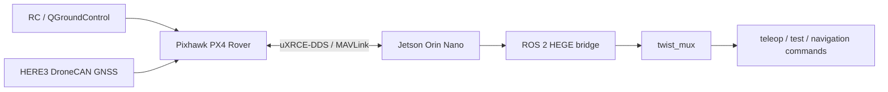

# HEGE GPS Navigation and PX4 Rover Stack

ROS 2 Humble packages and a reproducible development environment for the **HEGE Ackermann field rover**. The project was built from scratch around a Jetson companion computer, a Pixhawk running PX4 Rover, a DroneCAN GNSS receiver, and a custom Gazebo Harmonic vehicle model.

The repository contains:

- a measured URDF/Xacro model of the rover;
- RViz visualization and TF geometry;
- a Gazebo Harmonic simulation using `gz_ros2_control`;
- an Ackermann steering controller and `/cmd_vel` relay;
- a ROS 2–PX4 Offboard bridge with watchdogs and command acknowledgement handling;
- PX4 GPS, IMU and odometry conversion to standard ROS 2 messages;
- separate real-vehicle and PX4 SITL configurations;
- a devcontainer pinned to ROS 2 Humble and the matching external dependencies.

> **Scope:** The custom rover simulation, ROS/PX4 communication, sensor conversion, command arbitration and real-hardware data path have been exercised. This repository does **not** present GPS waypoint navigation, Nav2 coverage planning, RTK Fixed operation, or autonomous real-vehicle motion as completed results. `nav2_ackermann_hints.yaml` is a geometry-aware starting point, not a complete Nav2 deployment.

## System architecture



The real-vehicle setup keeps the control computer and flight controller responsibilities separate:

- **Pixhawk / PX4:** vehicle state estimation, rover control and actuator interface;
- **Jetson:** ROS 2 bridge, command arbitration, standard sensor topics and higher-level autonomy software;
- **ThinkPad workstation:** development, RViz, Gazebo Harmonic, PX4 SITL and QGroundControl.

## Verified project status

| Component | Status |
|---|---|
| ROS 2 Humble devcontainer | Working |
| Measured HEGE URDF/Xacro and RViz display | Working |
| Static TF geometry | Working |
| Gazebo Harmonic custom rover spawn | Working |
| `gz_ros2_control` controller manager | Working |
| Joint-state broadcaster | Working |
| Ackermann steering controller | Working |
| Simulated odometry and joint states | Working |
| Jetson–Pixhawk ROS 2 topic connection | Working |
| PX4 Offboard heartbeat at 20 Hz | Working |
| PX4 attitude and GNSS data reception | Working |
| ROS 2 GPS, IMU and odometry conversion | Working |
| HERE3 correction path and RTK Float outdoors | Working |
| HEGE field simulation: PX4 SITL drives the HEGE model in Gazebo through the same bridge | Working |
| Real vehicle motion from bridge Offboard velocity commands | Working (24 Sep 2026, after PX4 rover parameters were set; speed not yet calibrated) |
| Nav2 Ackermann parameter hints | Included as reference only |

## Vehicle parameters

The model uses measurements taken from the real vehicle.

| Parameter | Value |
|---|---:|
| Steering geometry | Ackermann |
| Wheelbase | 1.90–1.91 m |
| Track width | 1.55 m |
| Rear wheel radius | 0.40 m |
| Front wheel radius | 0.28 m |
| Maximum steering angle | approximately 35° |
| Approximate total mass | 1300 kg |
| `base_link` height | 1.10 m |
| IMU height | 1.20 m |
| GNSS antenna height | 1.30 m |

Using the bicycle model, the geometric minimum turning radius is

```text
R_min = L / tan(delta_max)
      = 1.91 / tan(35 deg)
      ≈ 2.73 m
```

The operational turning radius may be larger because the first real tests use conservative velocity and yaw-rate limits.

## Repository structure

```text
.
├── .devcontainer/                 ROS 2 Humble development container
├── hege_ws/src/
│   ├── hege_description/          URDF, RViz, Gazebo world and controllers
│   ├── hege_px4_bridge/           Ackermann/PX4 command bridge and safety logic
│   ├── hege_px4_sensors/          PX4 to standard ROS 2 sensor conversion
│   └── hege_bringup/              Real and simulation launch files
├── simulation/hege_field/         HEGE field scene, PX4 SITL profile and run/prepare scripts
├── scripts/                       Interface inventory and rosbag helpers
├── EXTERNAL_DEPS.txt              Pinned external dependency revisions
├── backups/                       Older Gazebo Classic description backup
└── hege_urdf_import/              Original description import
```

The active packages are under `hege_ws/src`. The `backups` and `hege_urdf_import` directories are retained for development history and must not be copied into an active colcon `src` directory.

## Main ROS 2 packages

### `hege_description`

- measured vehicle geometry;
- `base_footprint`, `base_link`, wheel, steering, IMU and GPS links;
- RViz display launch;
- Gazebo Harmonic world and spawn launch;
- `gz_ros2_control` Ackermann controller configuration;
- `/cmd_vel` relay for the standalone custom simulation.

### `hege_px4_bridge`

- subscribes to `/cmd_vel/selected`;
- converts ROS linear/angular velocity commands to the PX4 rover setpoint convention;
- publishes PX4 Offboard heartbeat and trajectory setpoints at 20 Hz;
- applies command timeout, speed, yaw-rate and steering constraints;
- supports software stop and neutral fallback;
- exposes supervised Arm, Disarm and Offboard services;
- waits for PX4 `VehicleCommandAck` before reporting command acceptance;
- has separate real and SITL parameter files.

### `hege_px4_sensors`

- converts PX4 NED/FRD data to ROS ENU/FLU conventions;
- publishes:
  - `/px4/odom`
  - `/px4/imu`
  - `/px4/gps/fix`
- preserves PX4 timestamps when the agent clock is synchronized;
- uses conservative covariance values when PX4 variance data is invalid.

### `hege_bringup`

- starts `twist_mux`;
- starts the PX4 bridge and sensor conversion node;
- optionally starts Micro XRCE-DDS Agent;
- provides separate `real.launch.py` and `sim.launch.py` files;
- includes Ackermann-aware Nav2 parameter hints.

## Prerequisites

- Ubuntu 22.04 inside the supplied devcontainer;
- ROS 2 Humble;
- Gazebo Harmonic;
- PX4-Autopilot v1.16.1;
- `px4_msgs` release/1.16;
- Micro XRCE-DDS Agent;
- `gz_ros2_control` for ROS 2 Humble;
- `ackermann_steering_controller`;
- `twist_mux`.

Pinned revisions are listed in [`EXTERNAL_DEPS.txt`](EXTERNAL_DEPS.txt).

## Development container

Clone the repository and open it with VS Code Dev Containers:

```bash
git clone https://github.com/oguzissik/hege_gps_navigation.git
cd hege_gps_navigation
code .
```

In VS Code, run **Dev Containers: Reopen in Container**. The image installs ROS 2 Humble, Gazebo Harmonic, `twist_mux`, MicroXRCEAgent v2.4.3 and the PX4 build toolchain. It does not contain the two external source trees, because they are large and pinned separately; a fresh clone has to fetch them once. Both directories are in `.gitignore`.

```bash
cd /workspaces/hege_gps_navigation

# px4_msgs, release/1.16 at the revision pinned in EXTERNAL_DEPS.txt
git clone --branch release/1.16 https://github.com/PX4/px4_msgs.git hege_ws/src/px4_msgs
git -C hege_ws/src/px4_msgs checkout 392e831

# PX4 firmware source, needed only for SITL (real robot work needs px4_msgs only)
git clone --branch v1.16.1 https://github.com/PX4/PX4-Autopilot.git
```

Then build the ROS workspace:

```bash
cd /workspaces/hege_gps_navigation/hege_ws
set +u
source /opt/ros/humble/setup.bash
colcon build --symlink-install
source install/setup.bash
```

`set +u` is used because some ROS setup scripts reference variables that may not yet exist when the shell has `nounset` enabled. The container's `postCreateCommand` only builds packages under the top-level `src/`, which is empty, so this `colcon build` in `hege_ws` is required.

On the real Jetson, `px4_msgs` lives in a separate workspace (`~/ws_others`), see "Real rover connection".

## RViz model check

```bash
cd /workspaces/hege_gps_navigation/hege_ws
set +u
source /opt/ros/humble/setup.bash
source install/setup.bash

ros2 launch hege_description display.launch.py
```

In another sourced terminal:

```bash
ros2 run tf2_ros tf2_echo base_footprint base_link
ros2 run tf2_ros tf2_echo base_link imu_link
ros2 run tf2_ros tf2_echo base_link gps_link
```

Expected vertical translations:

- `base_footprint -> base_link`: `1.10 m`
- `base_link -> imu_link`: `0.10 m`
- `base_link -> gps_link`: `0.20 m`

## Custom Gazebo Harmonic simulation

This launch runs the measured HEGE model with Gazebo Harmonic and `gz_ros2_control`.

Source the workspaces:

```bash
set +u
source /opt/ros/humble/setup.bash
source /workspaces/hege_gps_navigation/gz_ros2_control_ws/install/setup.bash
source /workspaces/hege_gps_navigation/hege_ws/install/setup.bash

export ROS_DOMAIN_ID=74
export ROS_LOCALHOST_ONLY=0

GZ_CONTROL_PREFIX="$(ros2 pkg prefix gz_ros2_control)"
export GZ_SIM_SYSTEM_PLUGIN_PATH="$GZ_CONTROL_PREFIX/lib:${GZ_SIM_SYSTEM_PLUGIN_PATH:-}"
```

Launch the custom rover:

```bash
ros2 launch hege_description gazebo.launch.py
```

Verify the controllers:

```bash
ros2 control list_controllers
```

Expected active controllers:

```text
joint_state_broadcaster
ackermann_steering_controller
```

Inspect simulation outputs:

```bash
ros2 topic echo /ackermann_steering_controller/odometry --once
ros2 topic echo /joint_states --once
```

Send a slow standalone simulation command:

```bash
ros2 topic pub --rate 10 /cmd_vel geometry_msgs/msg/Twist \
  "{linear: {x: 0.10}, angular: {z: 0.05}}"
```

Stop with `Ctrl+C`. Do not use this command on the real vehicle.

## PX4 SITL bridge

The PX4 bridge simulation uses PX4's Ackermann rover model. Start PX4 SITL separately:

```bash
cd /workspaces/hege_gps_navigation/PX4-Autopilot
make px4_sitl gz_rover_ackermann
```

In a second sourced terminal:

```bash
cd /workspaces/hege_gps_navigation/hege_ws
set +u
source /opt/ros/humble/setup.bash
source install/setup.bash

ros2 launch hege_bringup sim.launch.py
```

Optional scripted low-speed SITL command sequence:

```bash
ros2 launch hege_bringup sim.launch.py step_test:=true
```

This stock SITL path uses PX4's own small `gz_rover_ackermann` model. The combined path, where PX4 SITL drives the HEGE model on the field scene through the same bridge, is described next.

## HEGE field simulation (PX4 SITL + Gazebo Harmonic)

`simulation/hege_field/` runs the full command chain against a simulated HEGE, without any hardware:

```text
/cmd_vel/{teleop,test,nav} -> twist_mux -> /cmd_vel/selected -> hege_px4_bridge
  -> /fmu/in/offboard_control_mode + /fmu/in/trajectory_setpoint
  -> MicroXRCEAgent (UDP 8889) -> PX4 v1.16.1 SITL, airframe 4012 (Ackermann rover)
  -> AckermannVelControl / AckermannRateControl -> actuator_motors / actuator_servos
  -> Gazebo Harmonic, model hege_px4 on world hege_field
```

Sensor data comes back the same way and `hege_px4_sensors` converts it to `/px4/odom`, `/px4/imu`, `/px4/gps/fix`. The bridge, mux, sensors package and `px4_msgs` are the same files that run on the Jetson; only the launch file and the bridge parameter yaml differ.

Domain and port choices are fixed in the scripts so that a laptop running the sim can never talk to the real robot by accident:

| | Real robot | Field simulation |
|---|---|---|
| `ROS_DOMAIN_ID` | 73 | 74 |
| MicroXRCEAgent UDP port | 8888 (Jetson) | 8889 |
| PX4 DDS client | Pixhawk over Ethernet | SITL, `PX4_UXRCE_DDS_PORT=8889` set by `run.py` |
| `ROS_LOCALHOST_ONLY` | 0 | 0 |
| Gazebo partition | none | `hege-field-sim` |

`ROS_LOCALHOST_ONLY` must be 0 in the sim as well. With 1, ROS participants use loopback-only discovery and never match the agent, which is a plain Fast DDS application that ignores the variable; PX4 then publishes into the void and the bridge stays in `WAITING_PX4`. The port has to be passed as `PX4_UXRCE_DDS_PORT` because PX4 SITL's `rcS` reads it from the environment, not from the `UXRCE_DDS_PRT` parameter. `run.py` handles both. Nothing has to be edited after cloning.

### One-time preparation

After the dependency clones above, from the repository root:

```bash
set +u
source /opt/ros/humble/setup.bash
export HEGE_PX4_DIR=/workspaces/hege_gps_navigation/PX4-Autopilot

git -C "$HEGE_PX4_DIR" describe --tags --exact-match      # must print v1.16.1
git -C "$HEGE_PX4_DIR" submodule update --init --recursive Tools/simulation/gz
make -C "$HEGE_PX4_DIR" px4_sitl                          # 10-20 min the first time

cmake -S simulation/hege_field -B .hege_sim/plugin_build
cmake --build .hege_sim/plugin_build -j2
python3 simulation/hege_field/prepare.py --px4 "$HEGE_PX4_DIR"

cd hege_ws && colcon build --symlink-install --packages-up-to hege_bringup
```

Everything generated lands in the ignored `.hege_sim/` directory. The PX4 checkout is not modified. The scene assets (terrain heightmap, textures, world file) are committed under `simulation/hege_field/assets/`, so the preparation needs no other repository.

### Running it

Five terminals, all starting at `/workspaces/hege_gps_navigation`. Order matters: Gazebo, then PX4, then ROS. See `simulation/hege_field/README.md` for the same sequence with more detail.

Terminal 1, Gazebo:

```bash
python3 simulation/hege_field/run.py world
```

Terminal 2, PX4 SITL (after the scene is visible). The log must show `port:8889` and `home set`:

```bash
python3 simulation/hege_field/run.py px4
```

Terminal 3, agent + mux + bridge + sensors:

```bash
source /opt/ros/humble/setup.bash
source hege_ws/install/setup.bash
python3 simulation/hege_field/run.py ros
```

Terminal 4, checks and mode changes:

```bash
source /opt/ros/humble/setup.bash
source hege_ws/install/setup.bash
export ROS_DOMAIN_ID=74 ROS_LOCALHOST_ONLY=0
ros2 daemon stop

ros2 topic echo /hege/bridge/status --once
# NOT_OFFBOARD | nav_state=4 arming=1 | offb=0 vel=0 armed=0 | ...
ros2 service call /hege/bridge/set_offboard std_srvs/srv/Trigger
ros2 topic echo /hege/bridge/status --once
# NOT_ARMED | nav_state=14 arming=1 | offb=1 vel=1 armed=0 | ...
ros2 service call /hege/bridge/arm std_srvs/srv/Trigger
ros2 topic echo /hege/bridge/status --once
# CMD_TIMEOUT | nav_state=14 arming=2 | offb=1 vel=1 armed=1 | ...
```

`CMD_TIMEOUT` with `offb=1 vel=1 armed=1` means PX4 is ready and waiting for `/cmd_vel`. Terminal 5, a scripted slow drive (3 s stop, 5 s at 0.3 m/s, 5 s left arc, 5 s right arc, 3 s stop):

```bash
source /opt/ros/humble/setup.bash
source hege_ws/install/setup.bash
export ROS_DOMAIN_ID=74 ROS_LOCALHOST_ONLY=0
ros2 run hege_px4_bridge step_test --ros-args -p confirm_motion_test:=true
```

Terminal 4 shows `ACTIVE | ... | v=0.30 ...` and the model drives. Disarm with `ros2 service call /hege/bridge/disarm std_srvs/srv/Trigger`, then shut down in reverse order: Ctrl+C in Terminal 3, `shutdown` at the `pxh>` prompt, close Gazebo.

The PX4 parameter profile that `run.py` applies (`RO_MAX_THR_SPEED 4.0`, `RO_SPEED_LIM 1.0`, `RO_YAW_RATE_LIM 45`, `RO_YAW_P 3.0`, `RO_SPEED_P 1.0`, `RO_SPEED_I 0.1`, ...) is derived from the Gazebo wheel model. It is not a measurement of the real vehicle and must not be copied to the Pixhawk.

## Real rover connection

The tested real-hardware topology is:

```text
ThinkPad / QGroundControl
        |
        | Wi-Fi / LAN
        v
Jetson Orin Nano (ROS 2 Humble)
        |
        | UART / Ethernet data links
        v
Pixhawk V6X (PX4 Rover v1.16.1)
        |
        | DroneCAN CAN1
        v
HERE3 GNSS
```

Connection roles used during development:

| Interface | Value |
|---|---|
| ROS domain | `73` |
| UART baud rate | `921600` |
| Micro XRCE-DDS UDP port | `8888` |
| GNSS bus | DroneCAN CAN1 |

SSH into the Jetson:

```bash
ssh <jetson-user>@<jetson-ip>
```

Source the Jetson workspaces:

```bash
set +u
source /opt/ros/humble/setup.bash
source "$HOME/ws_others/install/setup.bash"
source "$HOME/hege_ws/install/setup.bash"
export ROS_DOMAIN_ID=73
export ROS_LOCALHOST_ONLY=0
```

Start the real bridge when Micro XRCE-DDS Agent is already running:

```bash
ros2 launch hege_bringup real.launch.py start_agent:=false
```

Check the connection from a second sourced Jetson terminal:

```bash
ros2 node list
ros2 topic hz /fmu/out/vehicle_attitude
ros2 topic hz /fmu/in/offboard_control_mode
ros2 topic echo /fmu/out/vehicle_gps_position --once
ros2 topic echo /hege/bridge/status --once
```

Observed rates during the hardware test:

- PX4 attitude: approximately `100 Hz`
- Offboard heartbeat: approximately `20 Hz`
- GNSS: approximately `5 Hz`

## Standard ROS sensor topics

With `hege_px4_sensors` running:

```bash
ros2 topic echo /px4/odom --once
ros2 topic echo /px4/imu --once
ros2 topic echo /px4/gps/fix --once
```

`/px4/odom` is PX4 EKF output. It is not independent wheel odometry and should not be fused again as if it were an unrelated measurement.

## Command arbitration

`twist_mux` selects one command source:

| Topic | Priority | Timeout |
|---|---:|---:|
| `/cmd_vel/teleop` | 100 | 0.25 s |
| `/cmd_vel/test` | 50 | 0.25 s |
| `/cmd_vel/nav` | 10 | 0.50 s |

Selected output:

```bash
ros2 topic echo /cmd_vel/selected
```

The bridge publishes neutral commands when the selected input becomes stale.

## Bridge status and supervised services

```bash
ros2 topic echo /hege/bridge/status --once
ros2 service list | grep '/hege/bridge'
```

The status line has the form

```text
STATE | nav_state=N arming=A | offb=x vel=y armed=z | psi=<yaw NED rad> | <detail> | ack=<last PX4 ack>
```

`STATE` is the bridge supervisor's verdict, first failing check wins: `SOFTWARE_STOP`, `WAITING_PX4` (no `VehicleStatus` yet), `PX4_STALE`, `NOT_OFFBOARD`, `NOT_ARMED`, `CMD_TIMEOUT` (ready, no fresh `/cmd_vel`), `ACTIVE`. `nav_state=14` is Offboard and `arming=2` is armed. `offb`, `vel` and `armed` mirror `flag_control_offboard_enabled`, `flag_control_velocity_enabled` and `flag_armed` from `/fmu/out/vehicle_control_mode`; these are the three flags PX4's `AckermannVelControl` checks before it produces any throttle. If all three are 1 and the vehicle still does not move, the cause is after the controller: unset rover parameters, output function mapping, or hardware.

Services provided by the bridge:

```text
/hege/bridge/set_offboard
/hege/bridge/arm
/hege/bridge/disarm
/hege/bridge/clear_software_stop
```

Real-hardware configuration defaults to:

```yaml
allow_remote_vehicle_commands: false
```

This keeps Arm and mode changes under RC/QGroundControl control. Remote service calls are intended only for a supervised acceptance test with the vehicle secured and the emergency stop available.

## GNSS and RTK observations

The tested correction path was:

```text
NTRIP corrections -> Jetson -> MAVLink GPS_RTCM_DATA
-> Pixhawk -> DroneCAN -> HERE3
```

The PX4 console showed incoming RTCM data and an increasing DroneCAN RTCM forwarding counter. Outdoors, HERE3 reached **RTK Float** (`fix_type=5`) with approximately `0.22 m` horizontal and vertical error estimates during the recorded test.

The NTRIP client and credentials are intentionally not stored in this public repository.

Useful PX4 MAVLink Console commands:

```text
listener gps_inject_data 5
listener sensor_gps 20
uavcan status
listener vehicle_local_position 5
listener estimator_status_flags 5
listener failsafe_flags 5
```

GPS fix types reported by PX4:

| Value | Meaning |
|---:|---|
| 3 | 3D GPS |
| 4 | Differential solution |
| 5 | RTK Float |
| 6 | RTK Fixed |

## Safety notes

The real platform is approximately 1300 kg. Before any motion test:

1. Keep the rover disarmed until all checks pass.
2. Use lifted driven wheels or a clear controlled area.
3. Keep the physical emergency stop and RC takeover ready.
4. Confirm the bridge reports a neutral command.
5. Confirm PX4 local velocity and heading estimates are valid.
6. Start with the configured `0.3 m/s` speed limit.
7. Disarm before stopping bridge processes.
8. Check the PX4 rover parameters. With `RO_MAX_THR_SPEED` at its default 0 or `RO_SPEED_LIM` at -1, PX4 v1.16.1 accepts arming and Offboard but its velocity controller silently does nothing (`AckermannVelControl::runSanityChecks`). `RO_YAW_RATE_LIM` at 0 disables the steering controllers the same way. Confirm with `param show RO_*` on the MAVLink console before a motion test.

The vehicle has no lidar, radar or depth camera in this project configuration. It cannot detect or avoid unexpected people, animals, vehicles or objects using this software stack alone.

## Troubleshooting

### `px4_msgs` message type is invalid

Re-source the overlays and restart ROS discovery:

```bash
set +u
source /opt/ros/humble/setup.bash
source "$HOME/ws_others/install/setup.bash"
source "$HOME/hege_ws/install/setup.bash"
export ROS_DOMAIN_ID=73

ros2 daemon stop
ros2 daemon start

ros2 interface show px4_msgs/msg/SensorGps
```

### Bridge stays in `WAITING_PX4` although PX4 is running

Check, in this order:

1. `ROS_LOCALHOST_ONLY` is 0 in every terminal and launch file that talks to the agent.
2. The agent and the PX4 client use the same UDP port (`8889` in the sim, `8888` on the Jetson). The PX4 log line `init UDP agent IP:..., port:...` shows what the client uses.
3. `ros2 daemon stop`, then retry. The daemon caches discovery with the environment it was first started in, and reports `Unknown topic` for topics it cannot reach.

### Old PX4 SITL after a Gazebo restart

A flood of `[vehicle_imu] ... timestamp error`, `MAG #0 failed: TIMEOUT`, `BARO #0 failed: TIMEOUT` and QGroundControl showing "Not Ready" means a PX4 process from an earlier run is still attached to a Gazebo that has since been restarted. PX4 runs in lockstep with Gazebo and cannot follow a simulation clock that jumped back to zero. Kill everything and start again in order:

```bash
pkill -f "bin/px4"; pkill -f MicroXRCEAgent; pkill -f "gz sim"; pkill -f twist_mux; pkill -f hege_px4
pgrep -a "px4|gz sim|MicroXRCE"     # must print nothing
```

### Edits to a launch file or a Python node have no effect

The launch reads from `hege_ws/install/`. Rebuild the package after editing: `colcon build --packages-select <package>`.

### Duplicate package names

```bash
find hege_ws/src -name package.xml -print \
  | xargs grep -h '<name>' | sort | uniq -d
```

Only one copy of each ROS package may remain inside the active workspace.

### Controller manager is unavailable

Confirm that the Harmonic control overlay was sourced before the HEGE workspace:

```bash
source /opt/ros/humble/setup.bash
source /workspaces/hege_gps_navigation/gz_ros2_control_ws/install/setup.bash
source /workspaces/hege_gps_navigation/hege_ws/install/setup.bash
```

Then check:

```bash
ros2 node list | grep controller
ros2 control list_controllers
```

## Acknowledgement

Developed during the TU Berlin ENHANCE Field Robotics Bootcamp as a from-scratch integration of ROS 2, PX4, Gazebo Harmonic, Jetson and Pixhawk for an agricultural Ackermann rover.
